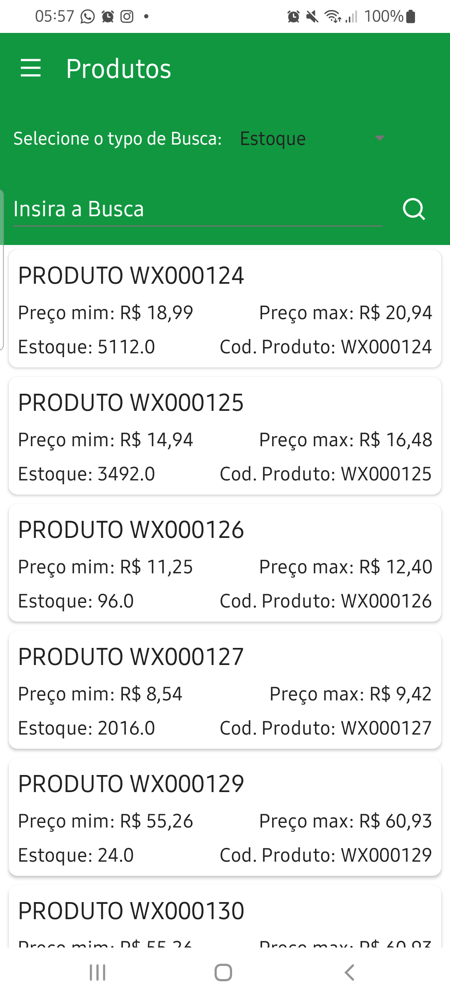
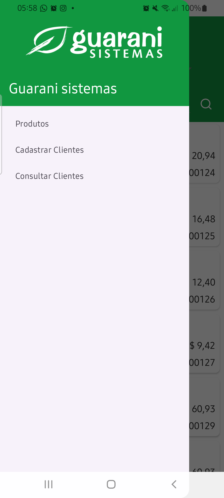
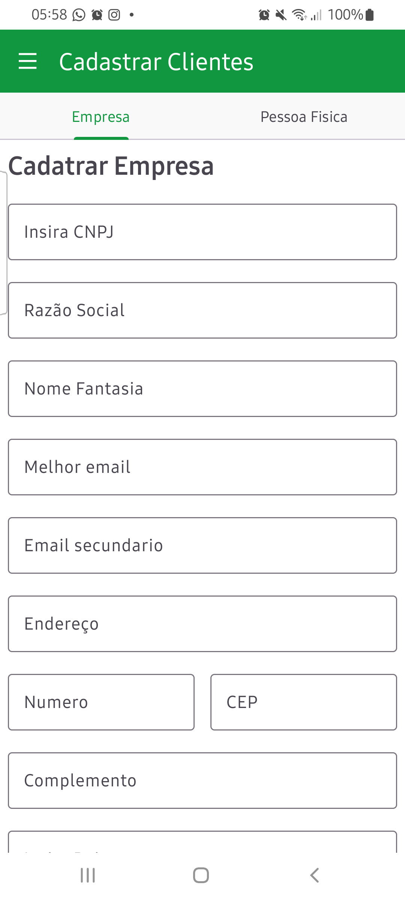
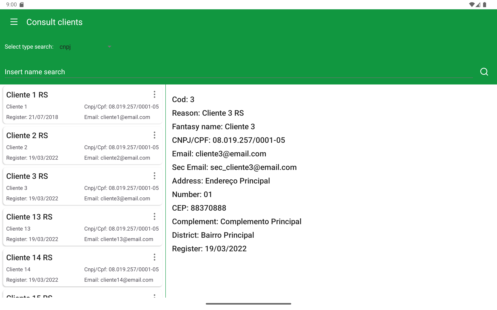

# Projeto Guarani

Projeto muito legal de fazer, onde foi aplicada varias praticas do android com a linguagem JAVA.
Ultilizados:

* Java -> Linguagem de programação
* XML -> Para o desenvolvimento das interfaces
* SQLite -> Puro, passa acesso ao banco de dados
* RxJava -> Para Trabalhos assíncrono
* Mvp -> Para arquitetura de desenvolvimento
* JUnit e Mockito -> Para testes (Em Desenvolvimento)

Segue Alguns Prints:

| Listas de comptas                   | Inserir valor do produto                         | Opçẽs para inserir produto                     |
|------------------------------------|--------------------------------------------------|------------------------------------------------|
|  |  |  |

Como todo projeto, sempre tem o que melhorar, este não é diferente 😂😁👍
